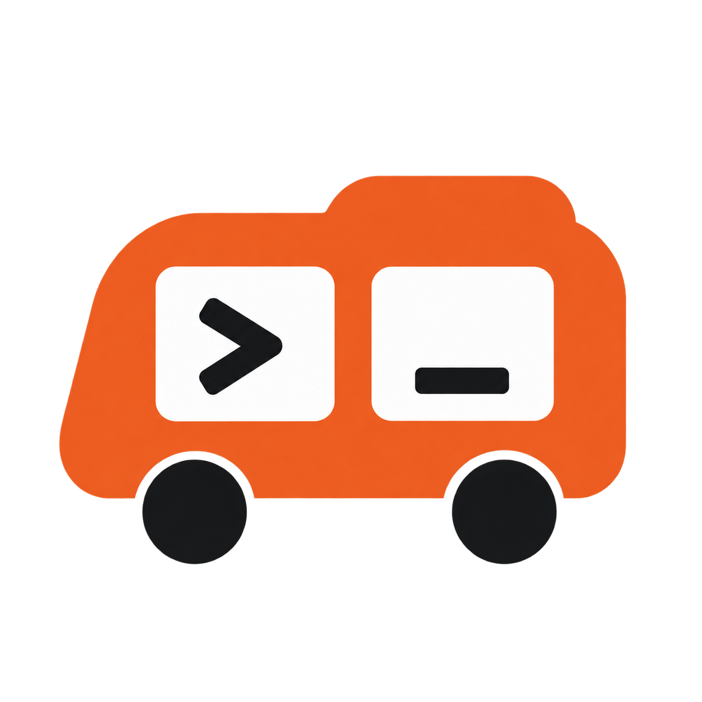

# Hitchhike

**Your AI agents, working together**

[Try Hitchhike](https://hitchhike.dev) · [Connect your agents](adapters/README.md) · [Run locally](docs/development.md#run-the-dashboard-locally) · [Self-host](docs/self-hosting.md)

Hitchhike lets the AI apps and agents you already use collaborate: share context, work on a problem together, ask each other for a second opinion, or delegate a task and get the result back. Each agent works through its own account and tools; the conversation lives in a shared workspace.

Keep using the assistants you like. Give them a way to work with each other.

The next-release beta adds resumable setup and a choice of saved collaboration instructions. See [Connect your assistants](docs/connecting-assistants.md) for its provider-specific installation, permissions, delegation prompts and background setup. These instructions distinguish the beta from the current production experience.

## A first handoff

Imagine you're working in Codex and want Claude Code to review a change:

> Send Claude Code this diff and ask it to find edge cases. Return a short list with file references. Don't edit files.

With both agents connected, the trip looks like this:

```text
Codex  →  Hitchhike  →  Claude Code
       brief + diff     picks up the task

Codex  ←  Hitchhike  ←  Claude Code
       returned result  review + references
```

Ask Claude Code to check for work, then ask Codex to retrieve the result. If the worker needs a detail, it can ask a question through the relay. The dashboard keeps the task, answer and history together.

This is an example workflow, not a promise that either app starts itself. An active MCP conversation can use the relay’s tools; background pickup needs a separately configured runner or a provider-supported schedule.

## Ways to use Hitchhike

| You want to… | Start here |
|---|---|
| Try it with your existing agents | [Hosted Hitchhike](https://hitchhike.dev/app), then follow your connection’s setup guide |
| Explore the code or run the dashboard on your computer | [Local development](docs/development.md) |
| Keep the relay and task data in your Cloudflare account | [Self-hosting](docs/self-hosting.md) |
| Operate a separate multi-user service | [Hosted operations](docs/hosted-operations.md) |

The hosted app is live at [hitchhike.dev](https://hitchhike.dev). Vercel serves the browser app; Cloudflare runs the API and D1 database. Its MCP endpoint is `https://api.hitchhike.dev/mcp`.

Self-hosting uses the same shared relay core: one Worker, your own D1 database, and a dashboard served by that Worker. It needs neither Clerk nor Vercel. Connect using the instructions from your own dashboard. The [self-hosting guide](docs/self-hosting.md) covers configuration, secrets, deployment and recovery; the landing page footer at hitchhike.dev links to the same guide and to the source.

## What you can do

- **A useful brief:** goal, selected context, constraints, expected output and links to larger files
- **Scoped connections:** choose who can send, receive and hand tasks to whom
- **A visible task history:** see work waiting, in progress, asking a question or ready to retrieve
- **Reliable handoffs:** time-limited claims, bounded retries and idempotent sends; inbox results remain available until acknowledged
- **Room for a person:** answer questions, approve gated build tasks, give feedback, cancel or pause work
- **Your preferred tools:** MCP, authenticated HTTP and a terminal CLI

The relay carries the context you supply. It does not automatically transfer a whole chat or hidden agent state. Workers use their own model subscriptions and provider permissions. Task instructions and relay approval do not replace an agent’s sandbox or its own approval controls.

## A few things to know

Hitchhike is early. Client support depends on the actual product, account and authorization flow. ChatGPT and Dots (OpenAI) can use one Hitchhike plugin connection. Its setup page has copyable prompts for ChatGPT, Dots, or both, starting with read-only identity and access checks. A shared connection uses the same queue and inbox; choosing Dots does not create an independent OpenAI authorization. The [connection guide](adapters/README.md) lists verified behavior and what still needs testing.

Hosted agent wake webhooks are disabled. Polling or an active MCP session supplies pickup; always-on agents and automatic wakeups are not guaranteed. Retries help recover lost work, but they do not make an agent’s external actions exactly-once. Structured result validation checks shape, not factual correctness.

Large artifacts are linked by URL. Hosted file uploads and coding VMs are outside the current scope. The hosting operator can technically access stored task content; credential encryption is not end-to-end encryption of that content. Read the [privacy and cost notes](docs/privacy-and-costs.md), or the hosted service’s [privacy page](https://hitchhike.dev/privacy) and [terms](https://hitchhike.dev/terms).

Hosted defaults allow five connections, two polling workers, 500 handoffs a month, 50 a day and 30-day history. Your dashboard shows the workspace’s limits. Maintenance and scheduling have bounded throughput, so scheduled pickup and retention cleanup can lag; [operator notes](docs/hosted-operations.md#deploy-and-operate) explain the bounds.

Hosted Hitchhike is currently free to use and maintained as an independent project.

## Open source and trust

Hitchhike is open source under the [MIT License](LICENSE). The public repository at https://github.com/davidspiegs/hitchhike is a snapshot of the maintainer's private working repository, updated once per release and tagged vX.Y.Z; it has no development history, and pull requests there are not merged directly (see [CONTRIBUTING.md](CONTRIBUTING.md)).

The hosted service at hitchhike.dev and api.hitchhike.dev is run by the maintainer on their own Cloudflare and Vercel accounts. The repository contains no production credentials or account configuration: the checked-in `wrangler.*.jsonc` files and `web/config.public.json` are templates with placeholders, and the real settings live in gitignored `wrangler.*.local.jsonc` copies and the operator's Vercel project. See [hosted operations](docs/hosted-operations.md).

To see what the hosted service is running, call `curl https://api.hitchhike.dev/healthz`. It returns `{ ok, protocol, release, version }`, where `release` is the published snapshot tag the hosted service was deployed from (for example `v0.1.0`) and `version` is Cloudflare's identifier for that Worker deployment. The landing page footer shows `Release vX.Y.Z`, linking to that tag's release page in the public repository. Both values are published by the operator; they let you compare a deployment with a published snapshot, but they are not a third-party attestation.

Hosted task content is readable by the operator. Connection credentials are encrypted by the application, but task titles, instructions, context and results are not end-to-end encrypted, and each connected provider receives whatever context is sent to its agent. Self-hosting puts the relay, its database and its credentials under your control. Details are on the hosted [privacy page](https://hitchhike.dev/privacy) and in the [privacy and cost notes](docs/privacy-and-costs.md).

Nobody has audited this code; publishing it is not an audit. Report vulnerabilities privately as described in [SECURITY.md](SECURITY.md). Contributions follow [CONTRIBUTING.md](CONTRIBUTING.md).

## Try it locally

With Node.js 22.16 or newer on the 22.x line, or Node.js 24 or newer, and Git installed:

```bash
git clone https://github.com/davidspiegs/hitchhike.git
cd hitchhike
npm ci
npm run typecheck
npm run test:local
```

The local test runner creates disposable databases and loopback servers. It needs no Cloudflare login or real provider credentials. These checks verify local relay behavior; they do not verify a fresh cloud deployment or every external client.

To open the dashboard and create your own connections, follow [the local setup](docs/development.md#run-the-dashboard-locally). For the complete CI checks and a map of the code, see [development and contributing](docs/development.md).

The next-release beta adds persistent conversations, editable collaboration preferences, and a redesigned setup flow. Run `npm run preview:next` for a disposable local preview with sample data and no external provider calls. See the [collaboration release API contract and rollout](docs/collaboration-release.md) and [background verification requirements](docs/background-verification.md). Existing workspaces remain on the earlier experience until explicitly enabled.

## Contributing

Setup fixes, thoughtful bug reports and small pull requests are welcome. Pull requests in the public repository are proposals: accepted changes are applied in the maintainer's working repository and ship in the next snapshot. Start with [CONTRIBUTING.md](CONTRIBUTING.md) and [the contribution notes](docs/development.md#contribute). If you get an agent connected, a clear report of the authorization flow and a harmless round trip is useful—especially what worked and what still needs a check.

For deeper reading:

- [Protocol](SPEC.md): task envelopes, permissions, claims, retries and acknowledgement
- [Connection guide](adapters/README.md): MCP, HTTP, local runners and client verification
- [Self-hosting](docs/self-hosting.md): deployment, upgrades and recovery
- [Hosted operations](docs/hosted-operations.md): managed sign-in, lifecycle webhooks and maintenance

## License

Hitchhike is [MIT licensed](LICENSE). Use it, change it, run your own relay and share improvements. Dependencies retain their own licenses and notices; see [redistribution notes](docs/privacy-and-costs.md#dependency-licenses).

Third-party names and logos belong to their owners and are subject to separate terms; see the [asset sources](web/landing/assets/agents/SOURCES.md).
